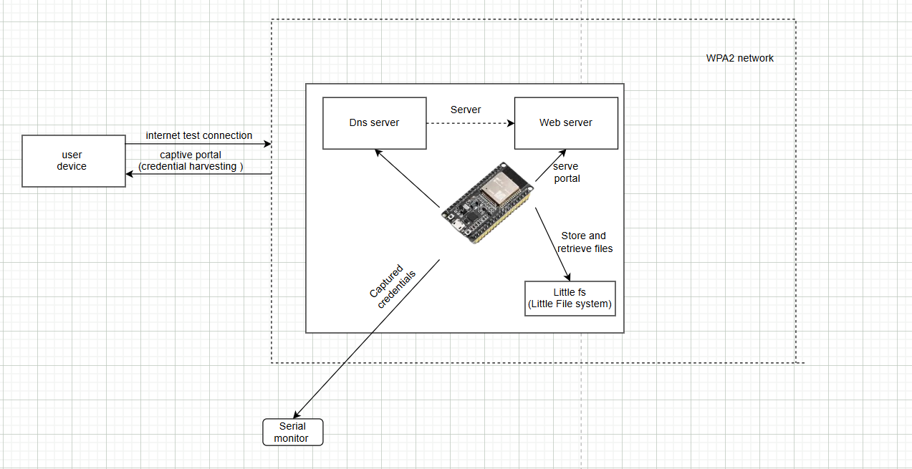

S1mple implementation for evil portal attack using the arduino IDE and esp32 little to store html, by its self its harmless, but implementationed with a deauth flood attack to redirect clients into your own EVIL AP 4 credential harvesting is where the magic truly happens.
Schematics of involved technologies:

Example of credential harvesting site: 
